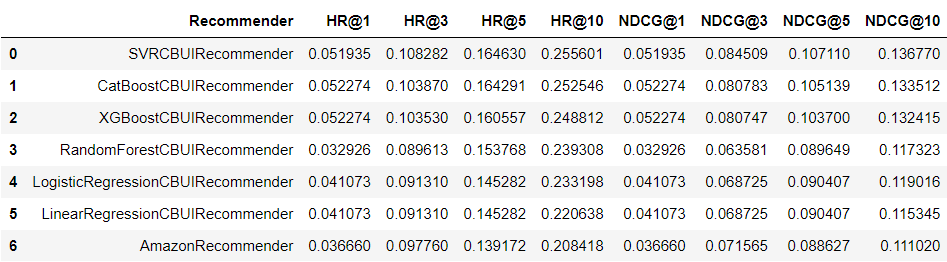

# project-1-content-based-recommender

## Table of contents
* [Summary](#summary)
* [Technologies](#technologies)
* [Setup](#setup)
* [Usage](#usage)
* [Project structure](#project-structure)
* [Feature engineering](#feature-engineering)
* [Models and results](#models-and-results)
* [References](#references)

## Summary
The goal of this project was to create a content-based recommender system for hotels. 
It includes three main steps:
- data preprocessing based on real-world dataset,
- eda and feature engineering,
- building and evaluating content-based models.

## Technologies
* Python 3.9 & pip
* Anaconda & Jupyter Notebook

## Setup
To run this project, install it locally using anaconda prompt:
```
conda env create --name rs-class-env -f environment.yml
```
You can replace *rs-class-env* with your own environment name.

Additionally, install extra packages using pip:
```
pip install -r requirements.txt
```

## Usage
In anaconda prompt, activate just created environment with the following command:
```
conda activate rs-class-env
```
Then type:
```
jupyter notebook
```
A new tab with Jupyter Notebook should open in your browser.

Main project notebooks are located in the `\notebooks` folder.

## Project structure
```
project-1-content-based-recommender
│   README.md
│   environment.yml
│   requirements.txt
│---data                        <- datasets used in the project
│   │   ...
|---data_preprocessing          <- scripts for data preprocessing
│   │   ...
|---evaluation_and_testing      <- scripts for model evaluation and testing
│   │   ...
|---feature_engineering         <- scripts for feature engineering
│   │   ...
|---htmls                       <- html files generated from notebooks
|   │   ...
|---imgs                        <- final results images
|   │   ...
│---notebooks                   <- main project notebooks
│   │---project_1_data_preparation.ipynb
│   │---project_1_eda.ipynb
│   │---project_1_recommender_and_evaluation.ipynb
|---recommenders                <- Amazon recommender benchmark
│   │   ...
|---
```

## Feature engineering

### User based features
I decided to use feature probability distribution per `user_id` as final user features.
I was also trying to average numerical features, however after further evaluation in XGBoost/CatBoost feature importances
and dython correlations with target variable, they haven't as much impact as distribution features.

### Item based features
For item features we have two main options, first is classic one-hot encoding.
Second is to leave features as it is and let CatBoost encode them using its native categorical features encoding. 
All of the item features are categorical features, that is why I decided to try CatBoost, as it may perform better than other GBDT models.


## Models and results
Final results are presented in below dataframe:


All of my models outperforms Amazon Recommender. 
Best model turns out to be SVR (0.256), however I'm not so convinced of it,
because of its very long training time and lack of interpretability.
I am more in favour of CatBoost, which scored very decent 0.253, which is 0.045 more than AmazonRecommender (0.208)

## References
Project is a part of [Recommender Systems class](https://github.com/PiotrZiolo/recommender-systems-class)
at the Department of Mathematics and Computer Science at Adam Mickiewicz University


